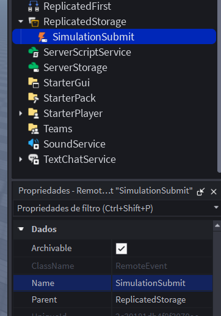
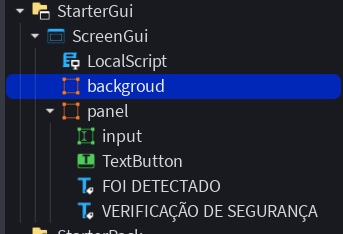
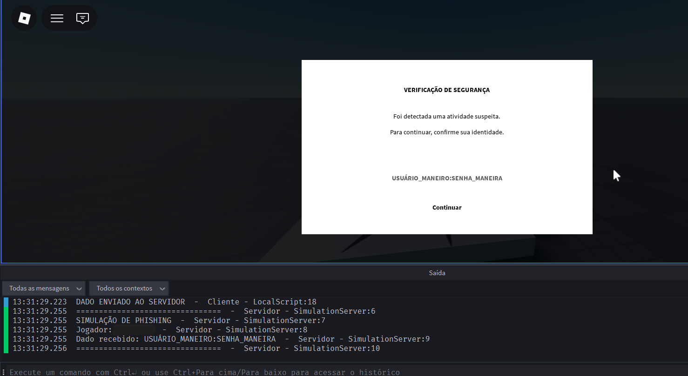
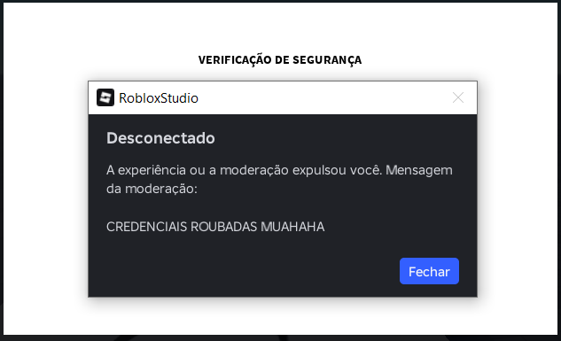

# Evidências — Reprodução Controlada

Esta pasta contém evidências visuais da reprodução controlada do cenário de
phishing investigado.

A reprodução foi realizada em um ambiente de teste utilizando uma experiência
controlada no Roblox. Nenhuma credencial real foi utilizada ou coletada.

---

## 1. Estrutura do RemoteEvent

O primeiro registro apresenta a estrutura do `ReplicatedStorage`, contendo o
`RemoteEvent` utilizado na simulação.

O objeto `SimulationSubmit` foi utilizado para demonstrar a comunicação entre
o cliente e o servidor após o usuário interagir com a interface.

A utilização do `RemoteEvent` permite representar, em ambiente controlado, o
fluxo de dados:

**Cliente → RemoteEvent → Servidor**

---

## 2. Estrutura da interface

Este registro apresenta a estrutura dos elementos presentes no `StarterGui`,
incluindo o `ScreenGui` utilizado pela simulação.

A interface foi construída para reproduzir visualmente uma situação de
verificação/moderação utilizada como parte da hipótese de engenharia social.

---

## 3. Interface de verificação

Este registro apresenta a interface da simulação antes da execução do fluxo.

A tela contém os elementos utilizados para representar uma falsa etapa de
verificação, incluindo a caixa de entrada e o botão de continuação.

O objetivo desta etapa não é reproduzir uma página legítima de login, mas
demonstrar como uma interface apresentada dentro de uma experiência pode ser
utilizada para induzir o usuário a fornecer uma informação.

---

## 4. Recebimento do dado pelo servidor

Este registro apresenta a execução do fluxo após a interação com o botão
**"Continuar"**.

Foi utilizado um valor fictício como entrada durante o teste. O registro
mostra o código responsável pelo envio do dado através do `RemoteEvent` e a
resposta correspondente no servidor.

O resultado demonstra que uma informação inserida na interface pode seguir o
fluxo:

**Entrada do usuário → LocalScript → `FireServer()` → `RemoteEvent` → servidor**

A demonstração foi realizada exclusivamente com dados fictícios. Não houve
envio de credenciais reais ou informações de autenticação.

---

## 5. Expulsão da experiência

Este registro apresenta a caixa de diálogo exibida após a execução da etapa de
expulsão do jogador.

A expulsão foi implementada como parte da simulação para representar um falso
evento de moderação utilizado na hipótese investigada.

A sequência reproduzida foi:

**Contato inicial → situação falsa de moderação → verificação falsa →
entrada de dado → processamento pelo servidor → expulsão**

A expulsão utilizada no teste é uma funcionalidade legítima da plataforma e
foi utilizada somente para reproduzir o comportamento visual e temporal do
cenário investigado.

---

## 6. Observação sobre a reprodução

Os registros acima documentam uma **PoC controlada** da mecânica de engenharia
social, e não uma demonstração de comprometimento real de uma conta.

A reprodução não demonstra que uma solicitação de amizade, por si só, permita
obter credenciais, tokens ou assumir uma conta.

Seu objetivo é demonstrar que recursos legítimos da plataforma podem ser
combinados com uma interface enganosa e engenharia social para criar um
cenário de phishing.

Nenhuma credencial real foi inserida, armazenada ou enviada durante a
reprodução.
